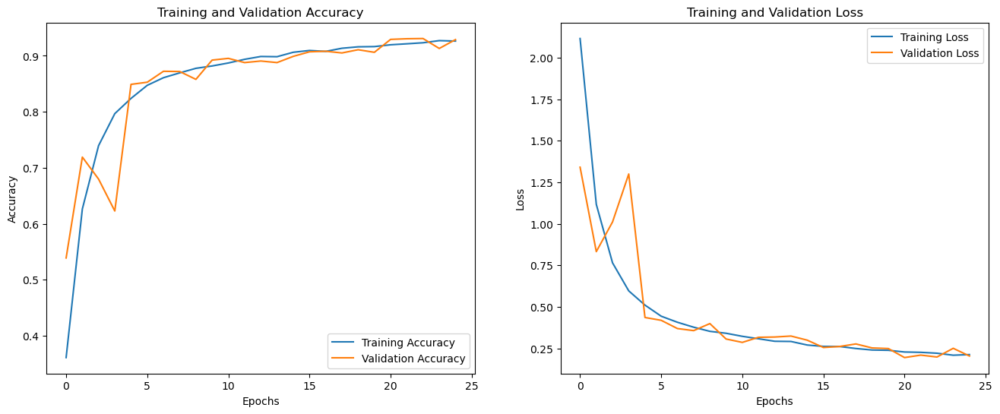
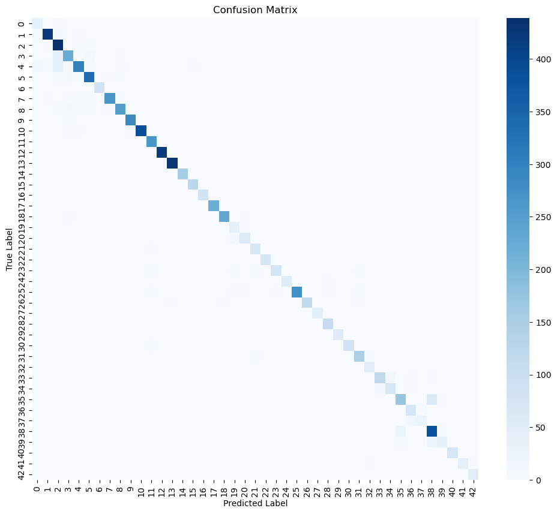
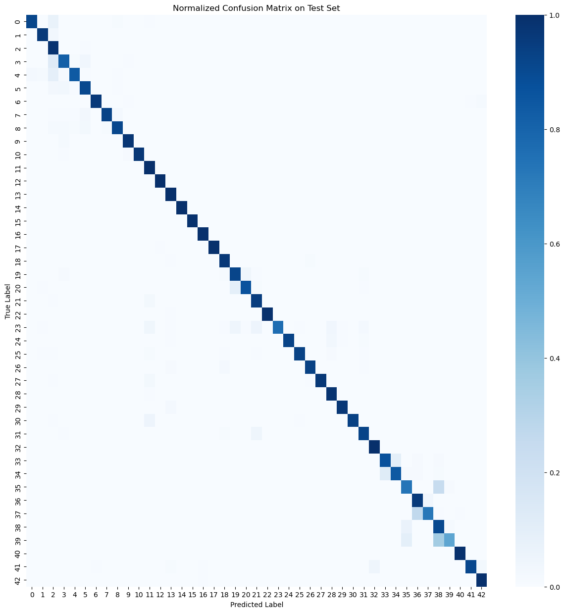
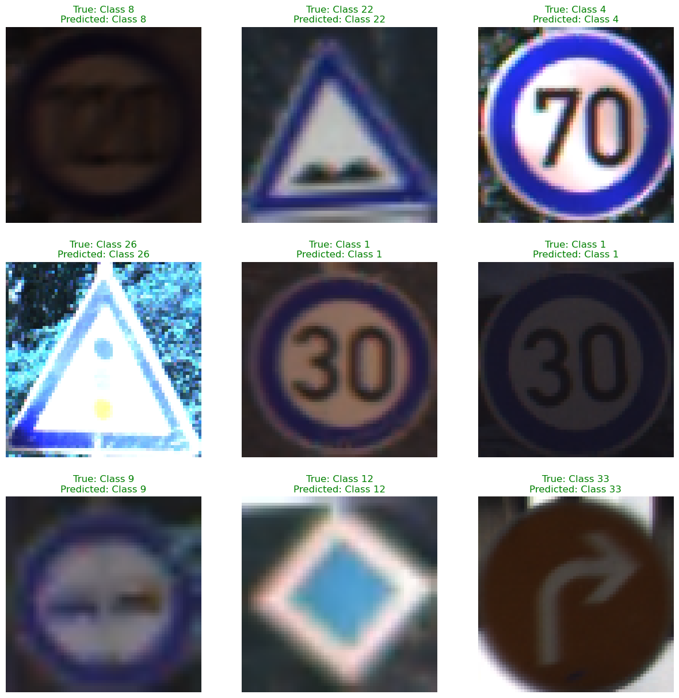

# Rapport sur les Problèmes Rencontrés lors du Projet GTSRB

## Introduction

Lors de ce projet de classification d'images sur le dataset GTSRB (German Traffic Sign Recognition Benchmark), j'ai rencontré plusieurs problèmes techniques qui m'ont poussé à ajuster ma méthodologie. Voici un résumé des principaux obstacles et des solutions que j'ai mises en place pour les surmonter.

## Problèmes Rencontrés

### 1. Difficulté avec la Stratégie Initiale

Initialement, j'avais l'intention de suivre la même méthode que le TP sur Cats vs Dogs, où j'utilisais des datasets préfaits, avec des prétraitements et des générateurs d'images standards. Cependant, cela ne fonctionnait pas comme prévu pour ce projet en raison de la différence dans la structure des données du GTSRB. J'ai donc dû changer de stratégie et opter pour un découpage manuel des images.

### 2. Préparation des Données

Pour gérer les images, j'ai enlever la partie qui verifie si les images sont corrompus, car le dataset est parfait, j'ai mis en place donc uniquement une boucle pour découper manuellement chaque image et stocker les labels associés. Ensuite, j'ai séparé les données en ensembles d'entraînement et de validation. Cela a pris plus de temps que prévu, mais m'a permis de m'assurer que chaque image était correctement prétraitée.

### 3. Problème d'Affichage des Images Normalisées

Un autre problème est survenu lors de l'affichage des images. Les images étaient normalisées avec des valeurs comprises entre 0 et 1, ce qui a provoqué des problèmes de visualisation. J'ai dû ajuster l'affichage en ajoutant une condition pour tenir compte de la normalisation pour que les images apparaissent correctement.

### 4. Difficulté avec l'Augmentation des Données

Pour l'augmentation des données, j'avais initialement créé une fonction personnalisée, mais celle-ci ne pouvait pas accepter l'argument training=True nécessaire pour que l'augmentation s'applique uniquement sur les donnees d'entraînement. Pour contourner ce problème, j'ai utilisé tf.keras.Sequential pour créer un pipeline d'augmentation compatible.

### 5. Création du Modèle

Lors de la création du modèle de réseau de neurones, j'ai également rencontré des problèmes avec le nombre de filtres dans les couches, qui n'étaient pas adaptés. J'ai dû ajuster ce nombre et supprimer l'étape de rescaling car les images étaient déjà normalisées. De plus, l'activation finale a été modifiée de None à softmax pour une meilleure prédiction des classes.

### 6. Entraînement du Modèle

Pour entraîner le modèle, il a été nécessaire d'utiliser des callbacks différents pour arreter l'entrainemt si val_loss ne s'ameliore pas, apres un certain nombre d'epochs, afin d'optimiser l'entraînement. De plus, lors de la compilation du modèle, J'avais un probleme de precision restante à 0.0 qui a été résolu en gardant metrics=["accuracy"].

## Résultats

### Training and Validation

### Test dataset

`1233/1233 [==============================] - 6s 5ms/step - loss: 0.1879 - accuracy: 0.9331`  
`Test Loss: 0.1879`  
`Test Accuracy: 0.9331`

`Classification Report  
 precision recall f1-score support

           0     0.7837    0.9143    0.8440       210
           1     0.9730    0.9590    0.9660      2220
           2     0.7983    0.9853    0.8820      2250
           3     0.8662    0.8170    0.8409      1410
           4     0.9606    0.8374    0.8948      1980
           5     0.9102    0.9097    0.9099      1860
           6     0.9902    0.9619    0.9758       420
           7     0.9838    0.9278    0.9550      1440
           8     0.9505    0.9121    0.9309      1410
           9     0.9644    0.9755    0.9699      1470
          10     0.9954    0.9726    0.9839      2010
          11     0.9387    0.9985    0.9677      1320
          12     0.9967    0.9990    0.9979      2100
          13     0.9777    0.9968    0.9872      2160
          14     0.9974    1.0000    0.9987       780
          15     0.9889    0.9921    0.9905       630
          16     0.9744    0.9952    0.9847       420
          17     0.9991    0.9946    0.9968      1110
          18     0.9651    0.9675    0.9663      1200
          19     0.7256    0.9190    0.8109       210
          20     0.9428    0.8694    0.9046       360
          21     0.8005    0.9485    0.8682       330
          22     0.9949    0.9949    0.9949       390
          23     0.9848    0.7627    0.8597       510
          24     0.9921    0.9296    0.9598       270
          25     0.9929    0.9327    0.9618      1500
          26     0.9723    0.9367    0.9542       600
          27     0.9915    0.9667    0.9789       240
          28     0.9107    0.9815    0.9447       540
          29     0.9813    0.9704    0.9758       270
          30     0.9929    0.9356    0.9634       450
          31     0.9449    0.9231    0.9339       780
          32     0.9339    1.0000    0.9658       240
          33     0.9190    0.8723    0.8950       689
          34     0.8329    0.8429    0.8379       420
          35     0.8299    0.7358    0.7800      1200
          36     0.8202    0.9590    0.8842       390
          37     0.9102    0.7238    0.8064       210
          38     0.8158    0.9029    0.8571      2070
          39     0.7535    0.5400    0.6291       300
          40     0.9755    0.9944    0.9849       360
          41     0.9865    0.9125    0.9481       240
          42     0.9735    0.9958    0.9846       480
    accuracy                         0.9322     39449
    macro avg 0.9300 0.9225 0.9239 39449
    weighted avg 0.9354 0.9322 0.9320 39449

